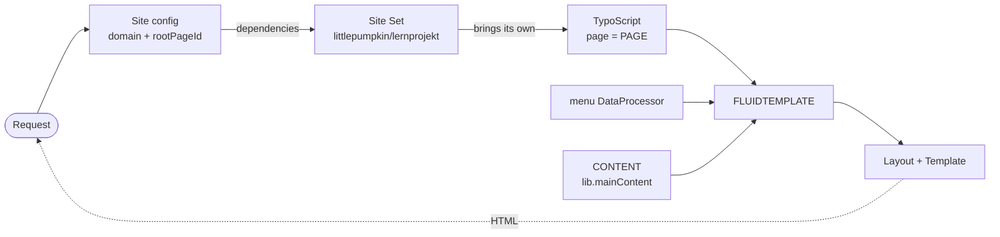

# 🎃 Pumpkin Studio — TYPO3 Build


> **A TYPO3 v13 sitepackage built from scratch — no generator, no boilerplate kit.**
>
> This is one of **three learning projects** that implement the same fictional agency
> website, "Pumpkin Studio", three times over: once in TYPO3, once as a WordPress block
> theme, once in Astro. Same pages, same content types, same design tokens — three
> entirely different routes to get there. The point is not the site. The point is the
> comparison.

| Repository | System |
|---|---|
| [typo3-lernprojekt](https://github.com/LittlePumpkin87/typo3-lernprojekt) | TYPO3 v13.4 |
| [wp-lernprojekt](https://github.com/LittlePumpkin87/wp-lernprojekt) | WordPress block theme (FSE) |
| [astro-lernprojekt](https://github.com/LittlePumpkin87/astro-lernprojekt) | Astro (SSG) |

The shared, frozen specification lives in [docs/SPEC.md](docs/SPEC.md) and is byte-identical
in all three repositories. The running comparison is collected in
[docs/COMPARE.md](https://github.com/LittlePumpkin87/astro-lernprojekt/blob/main/docs/COMPARE.md).

---

## ✨ Key Features & Technical Highlights

* **Site Sets instead of template records:** The sitepackage uses the v13 site-set mechanism
  throughout, so the entire configuration lives in code and in Git rather than in backend
  database records.
* **Composer distribution:** TYPO3 is installed as a Composer project, not unpacked from a
  zip. Extensions and core updates are reproducible from `composer.lock`.
* **Fluid from the ground up:** Layouts, templates and partials are written by hand — no
  scaffolding extension, no `ext:bootstrap_package`.
* **Content and code are separated:** Page content lives in the database and ships as a
  seed dump; the repository tracks only the sitepackage and the environment.
* **Environment as code:** DDEV configuration is versioned, so a fresh clone reaches a
  running backend in four commands.

---

## 🏗️ How a Request Is Rendered



The site configuration resolves domain and page, the site set activated via `dependencies`
brings its TypoScript along, `page = PAGE` renders a FLUIDTEMPLATE, the DataProcessor and
`CONTENT` supply navigation and page content, and Fluid assembles layout and template.

---

## 🚀 Getting Started (Local Setup)

### Prerequisites

* [DDEV](https://ddev.readthedocs.io/) and Docker

### Installation

```bash
git clone git@github.com:LittlePumpkin87/typo3-lernprojekt.git
cd typo3-lernprojekt
ddev start
ddev composer install
ddev import-db --file=db/seed.sql.gz   # page content lives in the DB, not in the repo
ddev launch                            # front end
ddev launch typo3                      # backend
```

After every change to TypoScript or YAML: `ddev typo3 cache:flush`.

---

## 📁 Project Structure

```text
packages/sitepackage/
├── composer.json                         Extension key "sitepackage"
├── Configuration/Sets/SitePackage/
│   ├── config.yaml                       Set "littlepumpkin/lernprojekt"
│   └── setup.typoscript                  page = PAGE → FLUIDTEMPLATE,
│                                         menu DataProcessor, lib.mainContent
└── Resources/Private/
    ├── Layouts/Default.html              Page skeleton, navigation, footer
    └── Templates/Default.html            Content area

config/sites/lernprojekt/config.yaml      base, rootPageId, dependencies → Set
```

---

## ⚡ Feature Spotlight: The Comparison Anchor

One section of the home page carries the entire purpose of these three repositories: a
**text/image section with an editorial left/right switch**.

In TYPO3 this becomes a **custom content element** — a CType registered in
`Configuration/TCA/Overrides/tt_content.php`, rendered through a Fluid template, with the
switch as a TCA field. WordPress solves the same requirement with a block and a
`block.json`, Astro with a component and an `align` prop.

Same visible result, three fundamentally different mental models. The write-up that comes
out of it is the actual portfolio artefact — see
[issue #7](https://github.com/LittlePumpkin87/typo3-lernprojekt/issues/7).

---

## 🛠️ Roadmap & To-Dos

Tracked as issues on the shared
[Pumpkin Studio board](https://github.com/users/LittlePumpkin87/projects/3).

* [x] Project setup, site configuration, sitepackage as a site set
* [x] Fluid skeleton — front end renders navigation and content elements end to end
* [x] Project infrastructure: frozen spec, journal, database seed
* [ ] [Content element "Teaser"](https://github.com/LittlePumpkin87/typo3-lernprojekt/issues/10) — register the CType, map it to a FLUIDTEMPLATE
* [ ] [Design tokens as an SCSS map](https://github.com/LittlePumpkin87/typo3-lernprojekt/issues/1)
* [ ] [Base layout: header, footer, navigation](https://github.com/LittlePumpkin87/typo3-lernprojekt/issues/2)
* [ ] [Content types](https://github.com/LittlePumpkin87/typo3-lernprojekt/issues/3): service, blog post, author with a relation
* [ ] [Home page sections](https://github.com/LittlePumpkin87/typo3-lernprojekt/issues/6)
* [ ] [Text/image section with a left/right switch](https://github.com/LittlePumpkin87/typo3-lernprojekt/issues/7) — the comparison anchor
* [ ] [List and detail pages](https://github.com/LittlePumpkin87/typo3-lernprojekt/issues/8)
* [ ] [Contact page and 404](https://github.com/LittlePumpkin87/typo3-lernprojekt/issues/9)

---

## 📖 Documentation

| File | Contents |
|---|---|
| [docs/SPEC.md](docs/SPEC.md) | The frozen site specification, shared by all three repositories |
| [docs/DECISIONS.md](docs/DECISIONS.md) | Every design decision, including the alternatives that were rejected and why |
| [docs/JOURNAL.md](docs/JOURNAL.md) | Session log — the entry point after a break |

<!-- Screenshots of the front end and backend go here once the layout stands. -->
